# 1. 클래스와 데이터

```java
/**
 * 클래스를 사용하면 int, String과 같은 타입을 직접 만들 수 있다 --> 클래스 생성 == 타입 생성
 * 사용자가 직접 정의하는 사용자 정의 타입을 만드려면 설계도가 필요하다. -> 이 설계도가 바로 클래스
 * 설계도를 기반으로 실제 메모리에 만들어진 실체를 객체 또는 인스턴스라고 한다. (객체 == 인스턴스)
 * Student student1 = new Student()
 * -> student1 변수는 이제 메모리에 존재하는 Student 객체(인스턴스)의 참조값을 가지고 있음. 
 */
public class Student {
    /**
     * 클래스에 정의한 변수들을 멤버 변수 또는 필드라고 함
     * 멤버변수 : 특정 클래스에 소속된 멤버라는 의미
     * 필드 : 데이터 항목을 가르키는 전통적인 용어. DB,엑셀 등에서 데이터 각각의 항목을 필드라고 한다.
     * 자바에서 멤버변수, 필드는 같은 뜻. 클래스에 소속된 변수.
     */
    String name;
    int age;
    int grade;
}
```

## 클래스, 객체, 인스턴스 정리

- 클래스
- -> 속성(변수)와 기능(메서드)를 정의
- 객체 vs 인스턴스
- -> 구분을 안해도 괜찮지만 구분을 해보면,
- -> '모든 인스턴스는 객체이지만, 우리가 인스턴스라고 부르는 순간은 특정 클래스로부터 그 객체가 생성되었음을 강조하고 싶을 때'

## 배열 도입

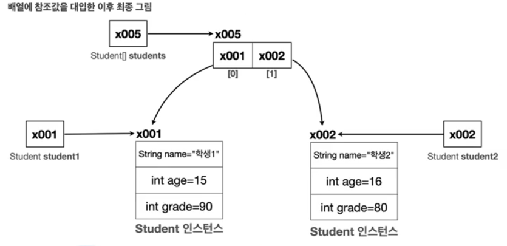

- 자바에서 대입은 항상 변수에 들어 있는 값을 복사해서 전달한다

```
students[0] = student1; // students[0] = x001;
students[1] = student2; // students[1] = x002;
```

- 주의) 변수에는 인스턴스 자체가 들어있는 것이 아님! 인스턴스의 위치를 가리키는 참조값이 들어있을 뿐. 따라서 대입(=)인스턴스가 복사되는 것이 아니라 참조값만 복사됨.

# 2. 기본형과 참조형

- 기본형 : 변수에 사용할 값을 직접 넣음
- 참조형 : 변수에 데이터에 접근하기 위한 참조(메모리 주소)를 저장. 참조형은 객체 또는 배열에 사용

## 기본형과 참조형 - 메서드 호출

- 메서드를 호출할 때 사용하는 매개변수(파라미터)도 결국 변수.
- -> 따라서 메서드를 호출할 때 매개변수에 값을 전달하는 것도 앞서 설명한 내용과 같이 값을 복사해서 전달한다.

```java
public class MethodChange1 {
    public static void main(String[] args) {
        int a = 10;
        System.out.println("메서드 호출 전 : a =" + a); // 10
        changePrimitive(a);
        System.out.println("메서드 호출 후 :  a = " + a); // 10
    }

    public void changePrimitive(int x) {
        x = 20; //주소가 아니라 값이 전달됨
    }
}

public class MethodChange2 {
    public static void main(String[] args) {
        Data dataA = new Data();
        dataA.value = 10;
        System.out.println("메서드 호출 전 : dataA.value =" + dataA.value); // 10
        changeReference(dataA);
        System.out.println("메서드 호출 후 :  dataA.value = " + dataA.value); // 20
    }

    public void changeReference(Data dataX) {
        dataX.value = 20; //주소가 아니라 값이 전달됨
    }
}
```

## 변수와 초기화

### 변수의 종류

- 멤버변수(필드) : 클래스에 선언
- 지역변수 : 메서드에 선언. 매개변수도 지역변수의 한 종류이다.

### 변수의 초기화

- 멤버변수(필드) : 자동초기화
- -> 인스턴스를 생성할 때 자동 초기화됨
- -> 숫자(int) = 0, boolean=false, 참조형=null, (null값은 참조할 대상이 없다는 뜻임)
- -> 개발자가 초기값을 지정할 수 있다
- 지역변수 : 수동초기화
- 지역변수는 항상 직접 초기화해야한다.

### null

- 참조형 변수에는 항상 객체가 있는 위치를 가리키는 참조값이 들어감
- 하지만 아직 가리키는 대상이 없거나 가리키는 대상을 나중에 입력하고 싶은 경우라면?
- -> 참조형 변수에 null 이라는 특별한 값을 넣어둘 수 있다.
- -> null은 값이 존재하지 않는, 없다는 뜻이다.
  cf) CG - 아무도 참조하지 않는 자의 최후..
- 인스턴스를 아무도 참조하지 않을 때
- -> 해당객체를 참조하는 곳이 모두사라지면 JVM은 필요없는 객체로 판단하고 GC를 통해 제거함

### NullPointerException

- 참조값 없이 객체를 찾아가려고 하면 발생하는 예외

```java
class BigData {
    Data data;
    int count;
}

class Main {
    public static void main(String[] args) {
        BigData bigData = new BigData();
        System.out.println(bigData.data); //null (출력됨) <- 멤버변수 초기화
        System.out.println(bigData.count); //0 <- 멤버변수 초기화
        System.out.println(bigData.data.value); // NullPointerException !
    }
}
```

- 정리 : NullPointerException이 발생하면 null 값에 .(점) 을 찍었다고 생각하기!

# 3. 객체지향 프로그래밍

### 클래스와 메서드

- 객체지향언어는 클래스 내부에 속성(데이터)과 기능(메서드)을 함께 포함할 수 있다.

```java
class Main {
    public static void main(String[] args) {
        ValueObject valueObject = new ValueObject();
        valueObject.add(); // 1
        valueObject.add(); // 2
    }
}

class ValueObject {
    int value;

    void add() {
        value++;
    }
}
```

- add()를 호출하면 메서드 내부에서 value++를 호출하게 된다. 이때 value에 접근해야하는데,
- -> 기본적으로 본인 인스턴스에 있는 멤버변수에 접근한다. 본인 인스턴스가 x002를 가지면 x002.value에 접근

# 4. 생성자

- 객체를 생성하는 시점에 어떤 작업을 하고 싶다면 생성자를 이용하면된다.
- 목표) 객체지향관점에서 속성과 기능을 한곳에 두기 <- 데이터 세팅 메서드를 객체에 두는 느낌

```java
class Main {
    public static void main(String[] args) {
        MemberInit member1 = new MemberInit(); //기존
        initMember(member1);
    }
    // .. initMember(){} -> 속성과 기능이 분리되어있다..
}
```

## this

```java
public class MemberInit {
    String name;
    int age;
    int grade;

    void initMember(String name, int age, int grade) {
        this.name = name;
        this.age = age;
        this.grade = grade;
    }
}

class Main {
    public static void main(String[] args) {
        MemberInit member1 = new MemberInit(); //기존
        member1.initMember("이름", 10, 5);
    }
}
```

### this 설명

- this: 메서드의 매개변수와 멤버변수이름이 같을 때, **메서드 내부에서는 메서드 매개변수의 스코프가 더 가깝기 때문에 매개변수가 우선.**
- -> **멤버변수에 접근하기 위해 변수앞에 this.를 붙인다**. 여기서 this.는 현재 인스턴스의 참조값을 가리킨다.

### this의 생략

- this는 생략 가능.
- -> 변수를 찾을 떄 가까운 지역변수(매개변수도 지역변수) 를 먼저 찾고 그 다음으로 멤버변수를 찾음
- -> 멤버변수도 없을 경우 에러
- this를 무조건 사용하는 코딩스타일이 있지만 최근에는 잘 쓰지 않음

## 생성자 - 도입

- 객체를 생성하고 이후에 바로 초기값을 할당해야하는 경우가 많음
- -> 앞서 initMember() 같은 메서드를 매번 만들어야함
- -> 생성자 사용 -> 생성자를 사용하면 객체를 생성하는 시점에 즉시 필요한 기능을 수행할 수 있다.
- 장점)
- -> 중복호출 제거,
- -> 제약-생성자 호출 필수 - 초기값 할당을을 실수로 호출하지 않는 경우 방지

## 기본생성자

- 매개변수가 없는 생성자를 기본 생성자라한다
- **클래스에 생성자가 하나도 없으면 자바 컴파일러는 매개변수가 없고, 작동하는 코드가 없는 기본 생성자를 자동으로 만들어준다.**
- 생성자가 하나라도 있으면 자바는 기본 생성자를 만들지 않는다.

## 생성자 - 오버로딩과 this()

```java
public class MemeberConstruct {
    String name;
    int age;
    int grade;

    MemeberConstruct(String name, int age) {
        this(name, age, 50); // <<- 생성자 this 활용하여 코드 중복 방지 !! (생성자 코드의 첫줄에서만 작성 가능)
    }

    MemeberConstruct(String name, int age, int grade) {
        this.name = name;
        this.age = age;
        this.grade = grade;
    }
}
```

# 5 패키지

- 다른 패키지의 같은 클래스명 사용하는 경우

```java
package pack;

import pack.a.User;

public class PackageMain {
    public static void main(String[] args) {
        User userA = new User();
        pack.b.User userB = new pack.b.User();
    }
}
```

## 패키지 규칙

- 패키지 이름은과 위치는 폴더 위치와 같아야한다.
- 패키지 이름은 모두 소문자를 사용한다 (관례)
- 패키지 이름은의 앞 부분에는 일반적으로 회사의 도메인 이름을 거꾸로 사용한다.

# 6. 접근제어자

## 접근제어자 종류

- private : 모든 외부 호출을 막는다
- default(package-private) : 같은 패키지 안에서 호출은 허용한다.
- protected : 같은 패키지 안 || **패키지 달라도 상속관계 호출 허용**
- public : 모든 외부 호출 허용
- private -> default -> protected -> public (외부 호출 범위 순서)

## 접근제어자 사용 위치

- 접근제어자는 **필드, 메서드, 생성자**에서 사용
- 추가로 **클래스 레벨에도 일부 접근제어자 사용**할 수 있다.

```java
public class Speaker { // 클래스레벨
    private int volume; // 필드

    public Speaker(int volume) {
    } // 생성자

    public void volumeUp() { // 메서드
    }
}
```

## 접근제어자 사용 - 클래스 레벨

- 클래스 레벨 접근제어자 규칙
- -> public, default만 사용가능 (private, protected 불가)
- -> **public 클래스는 반드시 파일명과 이름이 같아야한다.**
- --> 하나의 자바 파일에는 public 클래스 하나만 가능
- --> 하나의 자바 파일에 default 접근제어자 클래스 여러개 가능

## 캡슐화

- 캡슐화는 데이터와 해당 데이터를 처리하는 메서드를 하나로 묶어서 외부에서의 접근을 제한하는 것을 말한다.
- -> **속성과 기능을 하나**로 묶고, 외부에 꼭 **필요한 기능만 노출**하고 나머지는 모두 내부로 숨기는 것
- --> 1. 데이터 모두 숨기기, 2. 기능 필요한 것만 노출하기
    - --> 접근 제어자와 캡슐화를 통해 데이터를 안전하게 보호하고, 사용하는 개발자 입장에서 해당 기능을 사용하는 복잡도를 낮츨 수 있다.

# 7. 자바 메모리 구조와 static

## 자바 메모리 구조

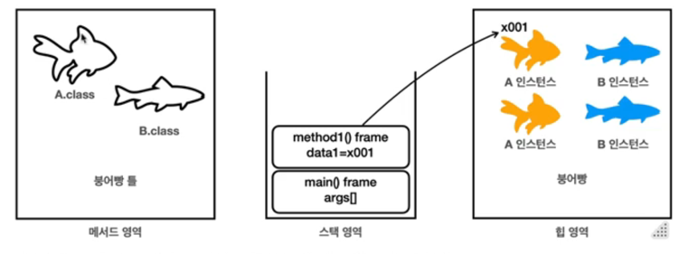

- 자바의 메모리 구조는 크게 메서드 영역, 스택 영역, 힙 영역 3개로 나눌 수 있음
- 메서드 영역 : 클래스 정보를 보관. (클래스 정보가 붕어빵 틀)
- 스택 영역 : 실제 프로그램이 실행되는 영역. 메서드를 실행할 때마다 하나씩 쌓인다
- 힙 영역 : 객체(인스턴스)/배열이 생성되는 영역. new 명령어를 사용하면 이 영역을 사용함. (붕어빵이 존재하는 공간)
  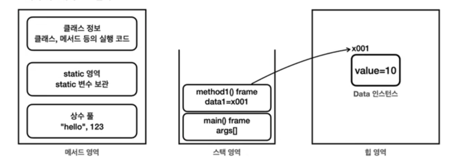

### 메서드 영역

- 메서드 영역은 프로그램을 실행하는데 필요한 공통 데이터를 관리함. 이 영역은 프로그램의 모든 영역에서 공유함
-
    1. 클래스 정보 : 클래스의 실행코드(바이트 코드), 필드, 메서드와 생성자 코드 등 모든 실행 코드가 존재함.
-
    2. static 영역 : static 변수들을 보관함.
-
    3. 런타임 상수 풀 : 프로그을 실행하는데 필요한 공통 리터럴 상수를 보관함.
- -> 프로그램에 "hello"라는 리터럴 문자가 있으면 이런 문자를 공통으로 묶어서 관리. 이외에도 프로그램 관리 위한 상수 관리

### 스택 영역

- 자바 실행 시 하나의 실행 스택이 생성된다.
- 각 스택 프레임은 지역 변수, 중간 연산 결과, 메서드 호출 정보 등을 포함한다.
- -> 정리) 자바는 **스택 영역을 사용해서 메서드 호출과 지역변수(매개변수 포함)을 관리**한다.
- 스택 프레임 : 스택 영역에 쌓이는 네모 박스가 하나의 스택 프레임이다.
- -> 메서드를 호출할 때마다 하나의 스택 프레임이 쌓이고, 메서드가 종료되면, 해당 스택프레임이 제거된다.
- cf) 스택 영역은 더 정확히는 각 쓰레드별로 하나의 실행 스택이 생성됨. 따라서 쓰레드 수 만큼 스택영역이 생성됨.

### 힙 영역

- 객체(인스턴스)와 배열이 생성되는 곳. 가비지 컬렉션이 이루어지는 주요 영역. 더 이상 참조되지 않는 객체는 GC에 의해 제거됨.
- -> 멤버 변수(필드)는 힙 영역 vs 지역변수(매개변수포함)은 스택 영역
- cf) 힙 영역 안에서만 인스턴스끼리 서로 참조하는 경우에도 GC 대상.

### 메서드 코드는 메서드 영역에

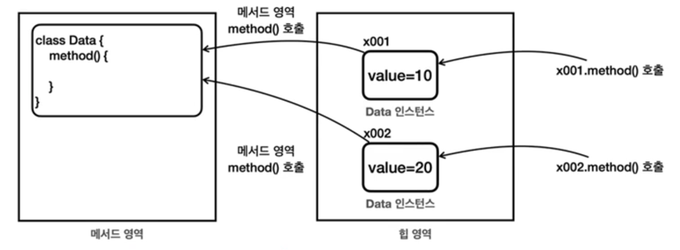

- 같은 클래스로부터 생성된 객체라도 인스턴스 내부의 변수 값은 서로 다를 순 있지만, **메서드는 공통된 코드를 공유**한다.
- -> 따라서 객체가 생성될 때 인스턴스 변수에는 메모리가 할당되지만, 메서드에 대한 새로운 메모리 할당은 없다
- -> 메서드는 메서드 영역에서 공통으로 관리되고 실행된다
- -> 정리하면, **인스턴스의 메서드를 호출하면 실제로는 메서드 영역에 있는 코드를 불러와서 수행**한다. (힙영역으로 코드를 불러옴!)

## static 변수

```java
public class Data3 {
    public String name;
    //    public int count;
    public static int count; //Data3 클래스가 몇개 생성되는지 알기위한 스태틱(정적)변수

    public Data3(String name) {
        this.name = name;
        count++; //Data3.count 도 가능 
    }
}
```

- 멤버변수에 static 을 붙이게되면 static변수, 정적변수 또는 클래스변수라고 한다.
  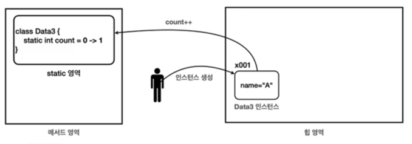
- static이 붙은 멤버변수는 **메서드 영역**에서 관리한다.
- 클래스명.변수명으로 접근
- 자신의 클래스에 있는 정적변수라면 클래스명 생략가능
- -> static 변수를 사용한 덕분에 공용 변수를 사용할 수 있게 됨

### 용어정리

```java
public class Data3 {
    public String name; //멤버변수(인스턴스변수)
    public static int count; //멤버변수(클래스변수)
}
```

- name, count 둘 다 멤버변수이다.

#### 멤버변수(필드)의 종류

- 인스턴스 변수: static이 붙지 않은 멤버변수.
- -> static이 붙지 않은 멤버변수는 인스턴스를 생성해야 사용할 수 있고, 인스턴스에 소속되어 있다.
- -> 인스턴스 변수는 인스턴스를 만들 때마다 새로 만들어진다
- 클래스 변수 : static이 붙은 멤버 변수
- -> 클래스변수, 정적변수, static 변수 등으로 부른다.
- -> static이 붙은 멤버변수는 인스턴스와 무관하게 클래스에 바로 접근해서 사용할 수 있고, 클래스 자체에 소속되어있다.
- -> 클래스 변수는 자바 프로그램을 시작할 때 딱 1개가 만들어진다. 인스턴스와 다르게 공유할 목적으로 사용된다.

### 변수와 생명주기

- 지역변수(매개변수 포함)
- -> 스택영역에 있는 스택 프레임에 보관됨. 메서드가 종료되면 스택프레임도 제거되는데, 이떄 해당 스택 프레임에 포함된 지역변수도 함께 제거됨
- 인스턴스변수
- -> 인스턴스 변수는 힙 영역을 사용. GC가 발생되기 전까지 생존하기 때문에 보통 지역변수보다 생존주기가 김
- 클래스변수
- -> **메서드영역의 static영역**에 보관됨. 메서드영역은 프로그램 전체에서 사용되는 공용공간
- -> **클래스 변수는 해당 클래스가 JVM에 로딩되는 순간에 생성**됨
- -> JVM이 종료될 때까지 생명주기가 이어져서 가장 긴 생명주기 갖음
- --> **static이 정적**이라는 이유가 여기에 있다. 프로그램 시작 시 한 번 생성되고 종료 시 제거되므로 정적이다.

## static 메서드

```java
public class DecoUtil1 {
    public String deco(String str) {
        return "*" + str + "*";
    }
}
```

- 위의 코드는 deco()를 호출하기 위해 DecoUtil1 인스턴스를 먼저 생성해야함
- -> 그런데 DecoUtil 클래스는 멤버변수도 없고 deco()라는 기능만 제공함
- -> **인스턴스가 필요한 이유는 멤버변수를 사용하는 목적**이 제일 큼
- --> static 키워드를 붙이면 인스턴스 생성 필요 없이 클래스로 메서드 바로 접근 가능

### 클래스 메서드 vs 인스턴스 메서드

- 클래스 메서드 : 메서드 앞에 static 키워드. 정적 메서드 혹은 클래스 메서드, static 메서드라 함. 인스턴스 생성없이 바로 접근가능
- 인스턴스 메서드 : static이 붙지 않은 메서드. 인스턴스를 생성해야 호출가능.

### 정적 메서드의 활용

- 객체 생성없이 메서드의 호출만으로 필요한 기능을 수행할 때 주로 사용
- 유틸리티성 메서드에 자주 사용.
- ex)수학 유틸 클래스 -> 인스턴스 변수 없이 입력 값을 계산하고 바로 반환하 것이 대부분일 때 정적메서드 사용해 유틸리티성 메서드 만들기도 함

### main() 메서드는 정적 메서드

- 인스턴스 없이 실생하는 대표적인 메서드는 main()
- 정적 메서드 이므로 정적 메서드만 호출할 수 있다.

# final 변수와 상수

- 변수에 final이 붙으면 더는 값을 변경할 수 없다
- final은 class, method를 포함한 여러군데에 붙을 수 있다

## final - 지역변수

```java
// final 지역변수 사용 예시
public class FinalLocalMain {
    public static void main(String[] args) {
        final int data1; // final 지역변수 1
        data1 = 10; //최초 한 번만 할당 가능 !!
        // data1 = 20; //컴파일에러 ! 
        final int data2 = 10; // final 지역변수 2
        // data2 = 20; //컴파일 에러!
    }

    static void finalArg(final int parameter) { //매개변수 할당 이후로 불변
        // parameter = 20; //컴파일 에러!
    }
}
```

- final을 지역변수에 설정할 경우 최초 한 번만 할당할 수 있다.
- 매개변수에 final이 붙으면 메서드 내부에서 값을 변경할 수 없다. 따라서 메서드 호출 시점에 사용된 값이 끝까지 사용된다

## final-멤버변수(필드)

```java
public class ConstructInit() {
    final int value; // 생성자 할당

    public ConstructInit(int value) {
        this.value = value; //final 멤버변수(필드) 생성자로 한 번만 할당
    }
}

public class FieldInit() {
    static final int MY_VALUE = 10; // 필드 할당 (상수)
    final int value = 10; // 필드 할당
    final int noInit; // 컴파일 에러 -> 초기화가 반드시 필요하다
//    public FieldInit(int value){ // final 필드 초기화 된 경우 생성자로 값을 할당해줄 수 없다 !!
//        this.value = value; 
//    }
}
```

- final을 멤버변수(필드)에 사용할 경우 생성자를 통해서 한 번만 할당할 수 있다.
- final 멤버변수(필드)를 멤버변수(필드)에서 초기화하면 이미 값이 설정되었기 때문에 생성자로도 값을 할당할 수 없다.
- static 에서도 final 선언 가능하다.
- cf) 생성자 할당 혹은 멤버변수 초기화를 하지 않은 경우(초기화 안된 경우)에 final 변수 컴파일 에러 발생 !
  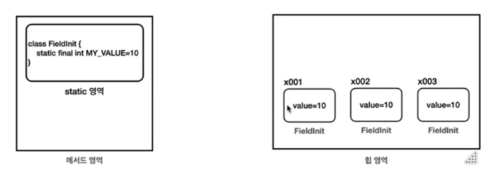
- FieldInit 과 같이 final 필드를 필드에서 초기화 하는 경우, 모든 인스턴스가 다음 오른쪽 그림과 같은 값을 가진다.
- 모든 인스턴스가 같은 값을 사용하기 때문에 메모리 낭비, 코드 중복 (JVM이 최적화를 시도할 수는 있음)
- -> 이럴 때 사용하면 좋은 것이 static -> **메서드 영역** !

### static final (상수)

- Field.MY_VALUE는 static (메서드) 영역에 하나만 존재.
- -> final를 사용하여 초기화 값이 변하지 않음
- -> static 영역에 하나만 존재하므로 메모리 낭비와 코드 중복을 막을 수 있음 !
- -> 이러한 이유로 보통 **final 멤버변수+멤버변수(필드)초기화 하는 경우는 static 을 붙여서 사용**하는 것이 좋다 !
- -> 이러한 final 멤버변수 + 멤버변수 초기화+ static 변수를 상수라고 함 !

### 상수

- 상수는 변하지 않고 일정한 값을 갖는 수를 의미함

#### 자바 상수 특징

- 자바에서는 static final 키워드를 사용함
- 대문자를 사용하고 구분은 언더바(_)로 함
- **필드를 직접 접근**해서 사용 -> 변경되지 않으므로 필드 직접 접근해도 문제가 없음
- 보통 상수는 public으로 많이 사용됨(접근제어자 필요한 경우도 있음)
- 중앙에서 값을 하나로 관리할수 있다는 장

## final 변수와 참조

- final을 기본형 변수에 사용하며 **값을 변경할 수 없다.**
- final을 참조형 변수에 사용하면 **참조값을 변경할 수 없다.**

```java
class Main {
    public static void main(String[] args) {
        final Data data = new Data();
        //data = new Data(); //참조값 변경 불가능
        data.value++; //참조 객체의 값은 변경 가능하다..
    }
}
```

# 상속

## 상속관계

- 기존 클래스의 **필드와 메서드**를 새로운 클래스에서 재사용하게 해줌.
- 자식은 부모의 필드와 메서드에 접근할 수 있지만, 부모에서 자식은 접근 불가.

## 상속과 메모리구조

- 상속관계를 객체로 생성할 때의 메모리 구조
  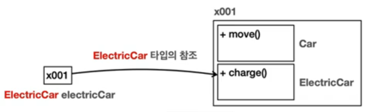

```java
class ElectricCar extends Car {
}
```

- new ElectricCar를 호출하면 상속관계에 있는 Car까지 포함해서 인스턴스를 생성함 !
- 참조값은 하나이지만 실제로 그 안에는 Car, ElectriCar라는 두가지 클래스 정보가 공존.
- -> 상속 관계를 사용하면 부모의 클래스 정보도 포함해서 생성되는 것
- -> 외부에서 볼 때 하나의 인스턴스를 사용하는 것 같지만, 내부에서는 부모와 자식이 모두 생성되고 공간도 구분됨!

### 상속관계에서 메서드 호출

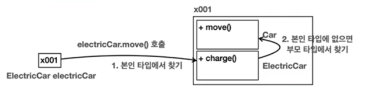

- electricCar.charge()를 호출하면 참조값을 확인하여 x001.charge()를 호출한다.
- -> 이때 부모인 Car를 통해서 charge()를 찾을지, ElectricCar를 통해서 charge()를 찾을지 선택해야함
- --> **이때 호출하는 변수의 타입(클래스)을 기준으로 선택함!**
- --> electricCar변수의 타입이 ElectricCar라면 인스턴스내부에 같은 타입인 ElectricCar를 통해서 charge()를 호출한다!
- electricCar.move()를 호출하면 참조값을 확인하여 x001.move()를 호출함
- -> ElectricCar를 먼저 확인하지만 move()가 없으므로 **부모타입으로 올라가서 move()를 호출함!**
- -> 부모로 계속해서 올라가도 필드나 메서드가 없는 경우 컴파일에러 발생

### 상속관계 메모리 구조 정리

-
    1. 상속관계 객체 생성시 그 내부에는 부모 자식 모두 생성됨
-
    2. 상속관계 객체 호출 시, 대상 타입을 정해야함 -> 호출자의 타입으로 대상 타입을 찾는다
-
    3. 현재 타입에서 필드 혹은 메서드를 찾지 못하면 상위 부모 타입에서 찾음 -> 못찾으면 컴파일 에러

## 상속과 네서드 오버라이딩

### 메서드 오버라이디 조건

- 메서드 이름 ; 메서드 이름이 같아야한다.
- 메서드 파라미터 : 파라미터 타입, 개수, 순서가 같아야한다.
- 반환타입 : 반환타입이 같거나, 하위 클래스 타입
- 접근제어자 : 상위 클래스의 메서드보다 더 제한적이어서는 안됨
- 예외 : 상위 클래스 메서드보다 더 많은 체크예외를 throw할 수 없다.
- -> 더 적거나, 같은 수의 예외, 또는 하위타입의 예외는 선언할 수 있음
- static, final, private이 붙은 메서드 오버라이딩 할 수 없음 (static은 클래스 레벨에서 작동하므로 인스턴스 레벨에서 사용하는 오버라이딩이 의미가 없음)
- 생성자 오버라이딩 : 생성자는 오버라이딩 할 수 없음

## 상속과 접근 제어

```java
package parent;

class Parent {
    public int publicValue;
    protected int protectedValue;
    default int defaultValue;
    private int privateValue;
}
```

```java
package child; //패키지가 부모와 다름 

import parent.Parent;

class Child extends Parent {
    public void call() {
        publicValue = 1; // 부모 필드 public 접근 가능
        protectedValue = 1; // 부모 필드 protected 접근 가능 (패키지가 달라도)
        // defaultValue = 1; // 부모 필드 default 접근 불가 
        // privateValue = 1; // 부모 필드 private 접근 불가
    }
}
```

### 접근 제어와 메모리 구조


- 같은 인스턴스 내부라도 자식 타입에서 부모 타입의 기능을 호출하는 것은 외부에서 호출한 것과 같기 떄문에 접근제어자가 영향을 준다.

## super - 부모참조

- 부모와 자식의 필드명이 같거나, 메서드가 오버라이딩 되어 있다면 자식에서 부모의 필드나 메서드를 호출할 수 없음
- 이때 super 키워드를 사용하면 부모를 참조할 수 있다. super는 부모클래스에 대한 참조를 나타낸다.

```java
public class Parent {
    public String value = "parent";

    public void hello() {
        System.out.println("Parent.hello");
    }
}

public class Child extends Parent {
    public String value = "child";

    @Override
    public void hello() {
        System.out.println("Child.hello");
    }

    public void call() {
        System.out.println(this.value); //parent
        System.out.println(super.value); //child
        this.hello(); //Child.hello
        super.hello(); //Parent.hello
    }
}
```

## super - 생성자

- 상속관계 인스턴스르 생성하면 결국 메모리 내부에는 자식과 부모클래스 각각 다 만들어짐
- Child를 만들면 부모인 Parent도 만들어 지는 것
- -> 따라서 부모 자식 각각의 생성자도 모두 호출되어야함.
- -> **상속관계를 사용하면 자식 클래스의 생성자에서 부모클래스의 생성자를 반드시 호출해야한다. (규칙)**
- -> 상속관계에서 부모생성자는 super(...)로 호출

```java
public class ClassA {
    public ClassA() {
        System.out.println("ClassA 생성자");
    }
}

public class ClassB {
    public classB(int a) {
        super(); //부모 기본생성자 생략가능
        System.out.println("ClassB 생성자 a == " + a);
    }

    public classB(int a, int b) {
        super(); //부모 기본생성자 생략가능
        System.out.println("ClassB 생성자 a == " + a + " b == " + b);
    }
}

public class ClasssC {
    public classC() {
        // super(); //컴파일에러 -> ClassB는 생성자 직접 정의했으므로 자바가 기본생성자를 만들지 않았음!
        super(10, 20); // 부모클래스의 생성자 직접 정의한 경우, 직접 정의한 생성자 중 하나를 호출해주어야함!!
        System.out.println("ClassC 생성자");
    }
}
```

- 상속을 받은 자식 클래스인 경우 생성자 첫줄에 반드시 super(...)를 호출 (부모가 기본생성자인경우 자동호출가능)
- -> 예외로 생성자 첫줄에 this(...)로 자신의 생성자 호출 가능하지만 마지막으로 호출된 자신의 생성자 첫줄엔 super(...)가 호출되어야한다.

### 정리 - 클래스와 메서드 final

- 클래스의 final : 상속 끝! final로 선언된 클래스는 확장(상속)될 수 없다.
- 메서드의 final : 오버라이딩 끝! final로 선언된 메서드는 오버라이딩 될 수 없다.

# 10. 다형성

## 다형성 - 시작

- 다형성은 객체지향 프로그래밍의 꽃
- -> **다형성은 한 객체가 여러 타입의 객체로 취급될 수 있는 능력**
- 다형성을 이해하기 위해서 필요한 두가지 개념 : 다형성 참조, 메서드 오버라이딩

### 다형적 참조

#### 부모타입의 변수가 부모 인스턴스를 참조


- Parent parent = new Parent();
- 부모타입인 Parent만 생성했기 때문에 메모리상에 Parent만 생성됨

#### 자식타입의 변수가 자식 인스턴스 참조

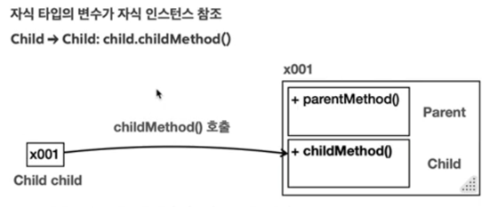

- Child child = new Child();
- 자식타입인 Child를 생성했기 때문에 메모리상에 Child와 Parent 둘 다 생성됨

#### 부모타입의 변수가 자식 인스턴스 참조 <<-- 다형적 참조 !!

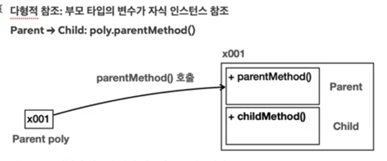

- Parent poly = new Child();
- 부모타입의 변수가 자식 인스턴스 참조
- Child 인스턴스를 만들었기 때문에 메모리상에 Child, Parent 둘 다 존재!
- -> 생성된 참조값을 Parent 타입인 poly에 담아둔다
- -> **부모는 자식을 담을 수 있다.** (자식은 부모를 담을 수 없음)
- --> 자식의 기능은 호출할 수 없음

#### 다형적 참조의 한계

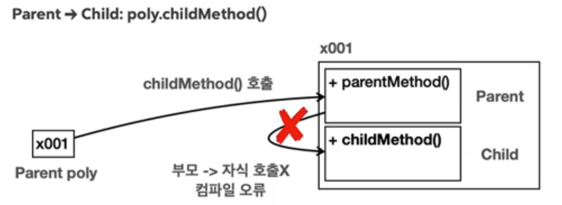

- Parent poly = new Child();
- poly.childMethod();// 컴파일에러
- 위의 경우 참조값을 통해 인스턴스를 찾고 변수의 타입인 Parent 클래스의 기능을 찾는다. Parent클래스에 해당 기능이 없고
- -> Parent의 부모는 존재하지 않으므로 컴파일 에러 발생시킨다.
- **상속관계는 부모방향으로 올라갈 수 있지만 자식 방향으로 내려갈 수 없다.**
- -> childMethod()를 호출하고 싶으면 다운캐스팅을 해야함

## 다형성과 캐스팅
### 다운캐스팅
```java
class Main {
    public static void main(String[] args) {
        // 부모 변수가 자식 인스턴스 참조
        Parent poly = new Child(); //x001
        // poly.childMethod(); //자식의 기능은 호출할 수 없다 (컴파일 에러)
        // 다운캐스팅 (부모타입 -> 자식타입)
        Child child = (Child) ploy; //x001
        child.childMethod();
    }
}
```

- 괄호 사이에 타입을 지정해서 참조대상을 특정 타입으로 변경할 수 있다. -> 캐스팅

### 캐스팅의 종류
#### 일시적 다운캐스팅
```
Parent poly = new Child();  // x001
((Child) poly).childMethod(); //((Child) x001).childMethod();
```
- ploy가 캐스팅 되는 것은 아님 -> 해당 참조값(x001)을 꺼내고 꺼낸 참조값이 Child 타입이 되는 -> poly의 타입은 유지
#### 업캐스팅
```java
class Main{
    //upcasting vs downcasting
    Child child = new Child();
    Parent parent1 = (Parent) child; // 업캐스팅은 생략 권장 
    Parent parent2 = child; // (다형성 참조 중에 업캐스팅, 다운캐스팅이 있는 것..)
}
```
#### 다운캐스팅과 주의점 -> 다운캐스팅 명시적으로 처리하는 이유
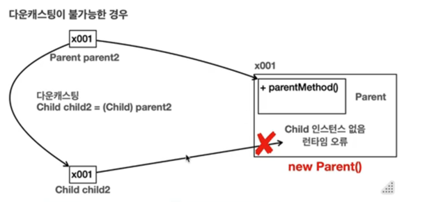
```java
class Main{
  public static void main(String[] args) {
        Parent parent1 = new Child();
        Child child1 = (Child) parent1;
        child1.childMethod(); // 문제 없음
        
        Parent parent2 = new Parent();
        Child child2 = (Child) parent2;  // 런타임 에러 !!! -> ClassCastException
        child2.childMethod(); //실행불가
  }
}
```
- 다운캐스팅은 인스턴스에 존재하지 않는 하위타입으로 캐스팅하는 문제가 발생할 수 있음!

## instanceof
- 다형성에서 참조형 변수는 다양한 자식을 대상으로 참조할 수 있음
- -> 참조하는 대상이 다양하므로 어떤 인스턴스를 참조하고 있는지 확인하려면 어떻게?
```
Parent parent1 = new Parent();
Parent parent2 = new Child();
```
- 변수들이 참조하고 있는 인스턴스의 타입을 확인하고 싶으면 instanceof 키워드를 사용